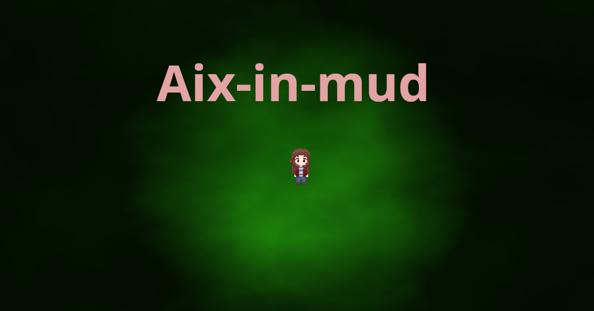

# GameJam Pixels-en-Provence

Bonjour tout le monde!

Ce dépôt regroupe le jeu que nous avons développer pour le gamejam du département informatique de l'IUT d'Aix-Marseille.
Nous avons utiliser le moteur de jeu Godot afin de réaliser ce jeu.

Pour plus d'informations sur l'évènement: https://itch.io/jam/pixels-en-provence

Notre équipe: Ewan FRANCOIS, Nina MATIC-CHARBIT, Audren METERY-DROUIN, Imad SERIDJ

---

Notre jeu se prénomme _**Aix-in-mud**_

Un épais nuage toxiques ainsi que des monstres de boues sont apparues et qui ont envahis les rues et dans le centre-ville d'Aix-en-Provence,
et la grande déesse de l'eau de la ville d'Aix-en-Provence vous demande de l'aide dans son combat contre ces monstres.

Armez-vous de votre arrosoir pour purifier les rues en arrosant les buissons/arbres qui s'y trouvent pour repousser les monstres et le brouillard!

